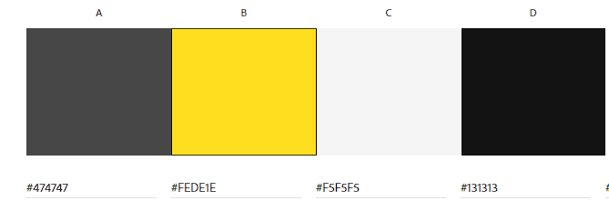

# Car Specialist

Car Specialist is a website that provides all the information about the car workshop. The site will be targeted towards the people who need the car repair services and it will deliver all necessary information about the range of services provided by the service as well as the possibility to book an appointment.

[Visit Car Specialist]()

## Table of Content

* [UX](#UX) 
    * [User Stories](#User-Stories)          
    * [Wireframes](#Wireframes)
    * [Colour Scheme](#Color-Scheme)
    * [Typography](#Typography)
    * [Agile Methodology](#Agile-methodology)

* [Features](#Features)
  * [Existing features](#Existing-features)
  * [Future Features](#Future-features)
  
* [Technologies Used](#Technologies-Used)
  * [Languages Used](#Languages)
  * [Frameworks, Libraries & Programs](#Frameworks-Libraries-Programs) 

* [Testing](#Testing)
  * [Manual testing](#Manual-testing)
  * [Validator Testing](#Validator-testing) 
  * [Testing User Stories](#Testing-user-stories)
  * [Bugs](#Bugs)

* [Deployment](#Deployment)

* [Credits](#Credits)
    * [Content](#Content)
    * [Media](#Media)
    
----------------------------
## UX
### User Stories          
### Wireframes

Wireframes were created for the desktop and the mobile devices. Each page is individually presented for mobile and desktop screens in the following links.

[Home page](docs/wireframes/homepage.png)

[Services page](docs/wireframes/servicespage.png)

[Booking page](docs/wireframes/bookingpage.png)

[My Bookings page](docs/wireframes/mybookingspage.png)

[Register/Sign In page](docs/wireframes/registerpage.png)

[Contact page](docs/wireframes/contactpage.png)

### Color Scheme

The color scheme is chosen based on some car service website designs founded on [Pinterest](https://www.pinterest.com/pin/163537030209768423/) that seemed suitable for the website theme.

### Typography

[Google Fonts](https://fonts.google.com/) was used for the following fonts: 
  * Racing Sans One for the headings on the website.
  * Roboto for the body text on the website. 

### Agile methodology

## Features
### Existing features
### Future features

## Technologies Used
### Languages

* Python version 3.8.11 - the main language used to build the back-end.
* HTML- markup language used to build the front-end templates.
* CSS- to style the content and provide the layout.

### Frameworks-Libraries-Programs

* Django - Python-based web framework that follows the model–template–views architectural pattern.
* Cloudinary -  for cloud-based image and video management services
* PostreSQL - used as database management system
* GitHub - project repository
* Gitpod - version control
* Heroku - cloud platform for deployment, managemant, and scaling the app
* ElephantSQL - PostgreSQL database hosting service.
* Code Institute GitPod Full Template - Using the GitPod Full Template from the Code Institute for my project.
## Testing
### Manual testing
### Validator testing
### Testing user Stories
### Bugs

* The submission of booking form did not work, it was not saved to database and it reported an error message about a field in the form. The error is fixed by removing the 'user' from the form fields and instead user data will be automatically retrieved when he loggs in.  

## Deployment

The project is deployed using Heroku. To deploy the project:

### Step 1: Installing Django and supporting libraries in terminal:

  1. Install Django and gunicorn: `pip3 install 'django<4' gunicorn`
  2. Install supporting libraries:  `pip3 install dj_database_url==0.5.0 psycopg2`
  3. Install Cloudinary Libraries: `pip3 install dj3-cloudinary-storage`
  4. Create requirements file `pip3 freeze --local > requirements.txt`
  5. Create project(carspecialist): `django-admin startproject carspecialist . `
  6. Create App (workshop): `python3 manage.py startapp workshop`  
  7. Add to installed apps in setting.py(Save file)
  8. Migrate changes `python3 manage.py migrate`
  9. Run Server to Test `python3 manage.py runserver`

### Step 2: Deploying an app to Heroku
**Create a new external Database**

The sqlite3 database was used in development, however this is only available for use in development so It was required to create a new external database which can be accessed by Heroku.

  10.  Go to the ElephantSQL.com, log in, and go to the dashboard and click the create new instance button on the top right.
  11.  Name the plan (your project name is a good choice), select tiny turtle plan (this is the free plan) and choose the region that is closest to you then click the review button.
  12.  Check the details are all correct and then click create instance in the bottom right.
  13.  Go to the dashboard and select the database just created.
  14.  Copy the URL (you can click the clipboard icon to copy).

**Heroku app setup**

  15.  From the Heroku dashboard, click the new button in the top right corner and select create new app.
  16.  Give your app a name (this must be unique), select the region that is closest to you and then click the create app button bottom left.
  17.  Open the settings tab and create a new config var of DATABASE_URL and paste the database URL you copied from elephantSQL into the value (the value should not have quotation marks around it).
  
**Attach the Database:**
  * Gitpod: 
  18. Create new env.py file on top level directory in gitpod
  * In env.py: 
  19. Import os library(import os)
  20. Set environment variables(os.environ["DATABASE_URL"] = "Paste in ElephantSQL database URL")
  21. Add in secret key(os.environ["SECRET_KEY"] = "Make up your own randomSecretKey")
  * In Heroku app:
  22. Add Secret Key to Config Vars(SECRET_KEY, “randomSecretKey”)

**Prepare our environment and settings.py file:**
  * In settings.py:
  23. Reference env.py (import os)
  24. Remove the insecure secret key and replace - links to the SECRET_KEY variable on Heroku (SECRET_KEY = os.environ.get('SECRET_KEY')
  25. Comment out the old DataBases Section and add new DATABASES Section (`DATABASES = {
   'default': dj_database_url.parse(os.environ.get("DATABASE_URL"))}`)
  * In terminal:
  26. Save all files and Make Migrations `python3 manage.py migrate`

**Get our static and media files stored on Cloudinary:**
  * In Cloudinary.com: (Note: must be logged in):
  27. Copy your CLOUDINARY_URL e.g. API Environment Variable.
  * In env.py(Gitpod):
  28. Add Cloudinary URL to env.py - be sure to paste in the correct section of the link (`os.environ["CLOUDINARY_URL"] = "cloudinary://************************"`)
  * In Heroku: 
  29. Add Cloudinary URL to Heroku Config Vars
  30. Add DISABLE_COLLECTSTATIC to Heroku Config Vars (temporary step for the moment, will be removed before deployment) `e.g. DISABLE_COLLECTSTATIC, 1`
  * Gitpod
  - In setting.py: 
  31. Add Cloudinary Libraries to installed apps `INSTALLED_APPS = [ …,'cloudinary_storage',
    'django.contrib.staticfiles','cloudinary',…,]`
  32. Tell Django to use Cloudinary to store media and static files( `STATIC_URL = '/static/'
  STATICFILES_STORAGE = 'cloudinary_storage.storage.StaticHashedCloudinaryStorage'
  STATICFILES_DIRS = [os.path.join(BASE_DIR, 'static')]
  STATIC_ROOT = os.path.join(BASE_DIR, 'staticfiles')
  MEDIA_URL = '/media/'
  DEFAULT_FILE_STORAGE = 'cloudinary_storage.storage.MediaCloudinaryStorage'`)
  33. Link file to the templates directory in Heroku `TEMPLATES_DIR = os.path.join(BASE_DIR, 'templates')`
  34. Change the templates directory to TEMPLATES_DIR `TEMPLATES = [{…,'DIRS': [TEMPLATES_DIR], …,],},},]`
  35. Add Heroku Hostname to ALLOWED_HOSTS `ALLOWED_HOSTS = ["carspeacialist.herokuapp.com", "localhost"]`  
  36. Create procfile on the top level directory (Gitpod) and add:`web: gunicorn carspecialist.wsgi`  
  37. Add, Commit and Push
  * Heroku
  38. Deploy Content manually through Heroku (Github as deployment method,enable automatic deployments,deploy on main branch)

## Credits
### Content 

### Media

The color scheme was inspired by these HTML template design: 
(https://creativemarket.com/etheme2/2938419-Car-Repair-Service-HTML-Template?u=ohlove&epik=dj0yJnU9SWlrRHhZOFctOENiQlBwaUN5MTd3YmU3Um1IZ0JiOGQmcD0wJm49M2JlSllfdGxQQjlsUXZTTzNrSGo1USZ0PUFBQUFBR1BnMUo4)

