# TESTING

* [Manual testing](#Manual-testing)
* [Validator Testing](#Validator-testing)
    * [Lighthouse](#Lighthouse) 
* [Testing User Stories](#Testing-user-stories)
* [Bugs](#Bugs)

## Manual testing
## Validator testing

The [W3C validator](https://validator.w3.org/) was used to validate all HTML pages and [Jigsaw](https://jigsaw.w3.org/css-validator/) to validate CSS. As the site is created with Django and utilises Django templating language within the HTML, I have checked the HTML by inspecting the page source and then running this through the validator.

* HTML

| Page | Result | Evidence |
| :--- | :--- | :---: |
| Home Page | Pass| [Home Page Validation](docs/testing/validation/homepagevalidation.png) |
| Services Page | Pass | [Services Page Validation](docs/testing/validation/servicespagevalidation.png) |
| Contact Us Page | Pass | [Contact Us Page Validation](docs/testing/validation/contactpagevalidation.png) |
| Book a Service Page | Pass | [Book a Service Page Validation](docs/testing/validation/bookservicevalidation.png) |
| My Bookings | Pass |[My Bookings Page Validation](docs/testing/validation/mybookingspagevalidation.png) |
| Update Booking Page | Pass | [Update Booking Validation](docs/testing/validation/updatepagevalidation.png)|
| Delete Booking Page| Pass | [Delete Booking Page Validation](docs/testing/validation/deletepagevalidation.png) |
| Register Page | Pass | [Register Page](docs/testing/validation/registerpagevalidation.png) |
| Login Page | Pass | [Login Page](docs/testing/validation/loginpagevalidation.png) |
| Logout Page | Pass | [Logout Page](docs/testing/validation/logoutvalidation.png) |
| Success Page | Pass | [Success Page](docs/testing/validation/successpagevalidation.png) |
| 404 error Page | Pass | [404 error Page](docs/testing/validation/404validation.png) |

* CSS

    * It passes the validation [CSS validation](docs/testing/validation/cssvalidation.png)

### Lighthouse

I have used Googles Lighthouse testing to test the performance, accessibility, best practices and SEO of the site.

* Desktop results

| Page | Result |
| :--- | :--- |
| Home Page | 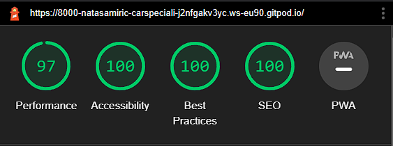 |
| Services Page | 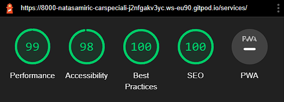 |
| Contact Page | 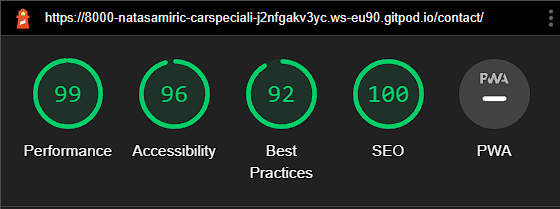 |
| Book a service Page | 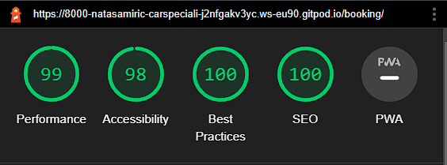 |
| My Bookings Page | 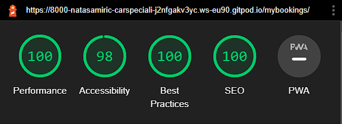|
| Update Page |  |
| Delete Page |  |
| Register Page |  |
| Login Page | 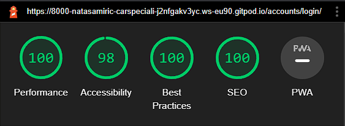 |
| LogoutPage | 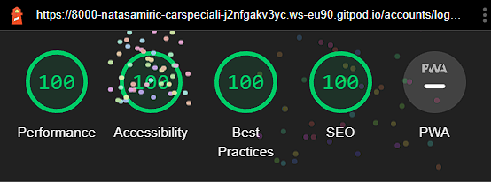 |

* Mobile results

| Page | Result |
| :--- | :--- |
| Home Page | 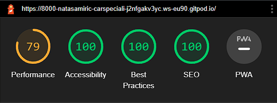 |
| Services Page | 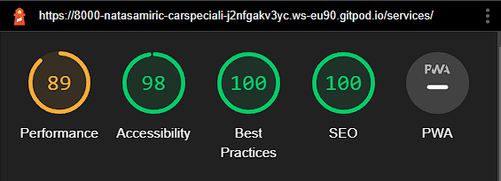 |
| Contact Page | 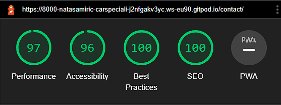 |
| Book a service Page |  |
| My Bookings Page | 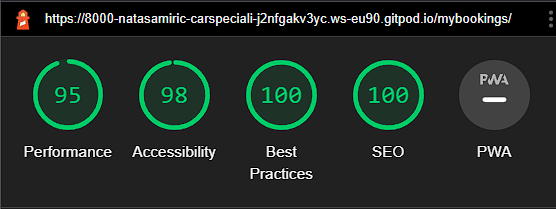|
| Update Page |  |
| Delete Page | 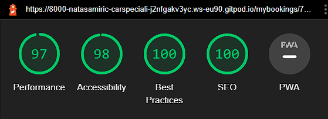 |
| Register Page | 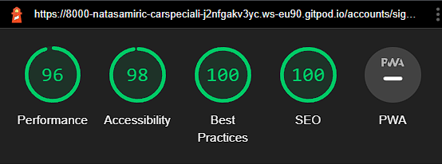 |
| Login Page | 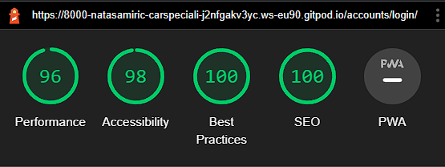 |
| LogoutPage | 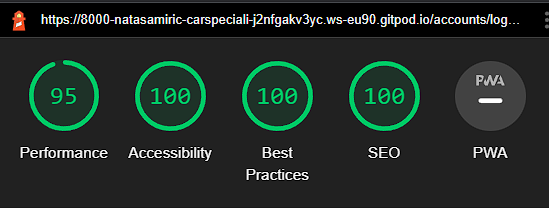 |

## Testing user Stories
## Bugs

### Fixed Bugs

* The submission of booking form did not work, it was not saved to database and it reported an error message about a field in the form. The error is fixed by removing the 'user' from the form fields and instead user data will be automatically retrieved when he loggs in.