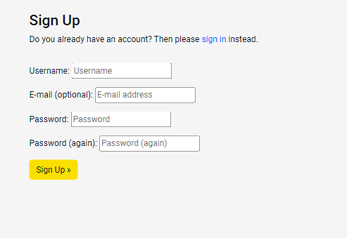

# TESTING

* [Validator Testing](#Validator-testing)
    * [Lighthouse](#Lighthouse) 
* [Manual testing](#Manual-testing)
    * [Testing User Stories](#Testing-user-stories)
* [Bugs](#Bugs)

## Validator testing

The [W3C validator](https://validator.w3.org/) was used to validate all HTML pages and [Jigsaw](https://jigsaw.w3.org/css-validator/) to validate CSS. As the site is created with Django and utilises Django templating language within the HTML, I have checked the HTML by inspecting the page source and then running this through the validator.

* HTML

| Page | Result | Evidence |
| :--- | :--- | :---: |
| Home Page | Pass| [Home Page Validation](docs/testing/validation/homepagevalidation.png) |
| Services Page | Pass | [Services Page Validation](docs/testing/validation/servicespagevalidation.png) |
| Contact Us Page | Pass | [Contact Us Page Validation](docs/testing/validation/contactpagevalidation.png) |
| Book a Service Page | Pass | [Book a Service Page Validation](docs/testing/validation/bookservicevalidation.png) |
| My Bookings | Pass |[My Bookings Page Validation](docs/testing/validation/mybookingspagevalidation.png) |
| Update Booking Page | Pass | [Update Booking Validation](docs/testing/validation/updatepagevalidation.png)|
| Delete Booking Page| Pass | [Delete Booking Page Validation](docs/testing/validation/deletepagevalidation.png) |
| Register Page | Pass | [Register Page](docs/testing/validation/registerpagevalidation.png) |
| Login Page | Pass | [Login Page](docs/testing/validation/loginpagevalidation.png) |
| Logout Page | Pass | [Logout Page](docs/testing/validation/logoutvalidation.png) |
| Success Page | Pass | [Success Page](docs/testing/validation/successpagevalidation.png) |
| 404 error Page | Pass | [404 error Page](docs/testing/validation/404validation.png) |

* CSS

    * It passes the validation [CSS validation](docs/testing/validation/cssvalidation.png)

* Python

[Code Institute Python Linter](https://pep8ci.herokuapp.com/) was used to validate the python.

    All pages are clear, no errors found. 

### Lighthouse

I have used Googles Lighthouse testing to test the performance, accessibility, best practices and SEO of the site.

* Desktop results

| Page | Result |
| :--- | :--- |
| Home Page |  |
| Services Page |  |
| Contact Page |  |
| Book a service Page |  |
| My Bookings Page | |
| Update Page |  |
| Delete Page |  |
| Register Page |  |
| Login Page |  |
| LogoutPage |  |

* Mobile results

| Page | Result |
| :--- | :--- |
| Home Page |  |
| Services Page |  |
| Contact Page |  |
| Book a service Page |  |
| My Bookings Page | |
| Update Page |  |
| Delete Page |  |
| Register Page |  |
| Login Page |  |
| LogoutPage |  |

## Manual testing
## Testing User Stories

| As a/an | I want to be able to ... | So that I can... | How is this achieved? | Evidence |
| :--- | :--- | :---| :--- | :---: |
| Registered user | book a service |  book the time for service | If the user is logged in, he should be able to click on Book Now button that is located on the landing page or click on Booking that is located in navbar and then click on Book a service. This action will take the user to the page where is located the booking form. User should fill out all the details and click on Book button below the form. In case the user is not logged in and goes to Book a service page, he will be redirected to login page |  |
| Registered user | choose a service type from the list when creating a booking |  I have a better overview of all services provided in the workshop | When the user clicks on the service type field in the Book a service form, then appears a list where he can select the desired service |   |
| Registered user | to choose a time in my booking | choose the time to drive my car to the service that suits me best| User can choose a date and select offered time when he click on time field in Book a service form |  |
| Registered user | see my bookings  | remind myself and check booking details | If the user is logged in, he should be able to click on Booking in navbar and then choose and click on My bookings where he will find all requested bookings |  |
| Registered user | update my booking | make necessary changes in booking details and change date, time or type of service that I want | User should be able to click on My bookings page where he will find all his bookings and click on Update button on the booking that he wants to change and each field can be changed to another value |  |
| Registered user | delete my booking | cancel my booking| User should be able to click on My bookings page where he will find all his bookings and click on Delete button that will lead user to the page on which he will be prompt if he is sure that he wants to delete booking and he will see all booking details |  |
| Registered or anonymous user | contact the workshop | send a message through the website to the workshop and get the information that I need | There is a link in navbar with the name Contact Us where the user should click and he will be redirected to contact page where is the contact form. User should fill out all required details and click on Send button underneath the message field  |  | 
| Registered user |log in to my account | manage my bookings| User should be able to find the Login link in navbar and when he click on it he will see the sign in form where he should fill all required fields and click on Sign in |  |
| Anonymous user |  register an account  | manage my bookings | User should be able to find the register link in navbar and when he click on it he will see the sign up form where he should fill all required fields and click on Sign up |  |
| Admin | approve or disapprove bookings | manage all the appointments| Admin should go to admin page,log in and he will see admin panel where he should be able to click on Bookings. On Bookings page should be listed all registered bookings and when the admin clicks on certain booking, he will see all the details and on the bottom is approved checkbox where he should click if he wants to approve the booking and then click save. There is also an option for approval above the booking list which gives possibility to select several bookings from the list and approve them in the same time by clicking on that empty field, click on approved and then click 'go' |  |

### Full Testing

Full testing was performed on the following devices:

    Mobile:
        Samsung Galaxy S10+
        Samsung Galaxy S20 Ultra
        iPhone 12 Pro
        iPhone 6/7/8 Plus

    Tablet:
        iPad Pro   
    Desktop
        32 inch ultrawide Monitor

Testing was also performed using the following browsers:

   * Chrome
   * FireFox
   * Opera

| Feature | Expected Outcome | Testing Performed | Result | Pass/Fail |
| :--- | :--- | :--- | :--- | :--- |
| **NAVBAR** |
| Book Now button | Clicking on the button should take user to Book a service page | Clicked on book now button | Taken to the correct page | Pass |
|  | When user hover over button, text should change the color to white and it shows yellow border around it  |  Hovered over button | Text changed color to white,border is present | Pass |
| Logo | Clicking on the the logo should take user to home page | Clicked on logo | Taken to the correct page | Pass |
|  | When user hovers over logo it should change color to white  | Hovered over logo | Logo changed color to white | Pass |
| Home link | Loads the home page if clicked | Clicked home | Taken to the correct page | Pass |
| Services link | Loads the services page if clicked |  Clicked services | Taken to the correct page | Pass |
| Contact us link | Loads the contact page if clicked |  Clicked contact us | Taken to the correct page | Pass |
| Book a service/Booking | If user is not logged in it should be Book a service link and if the user is logged in there is a Booking dropdown menu | Viewed links as a logged in and as a not logged in user | The correct links are displayed dependant on the users privileges| Pass |
|  | User not logged in - when user clicks on Book a service it should take him to sign in page | Clicked on link | Taken to the correct page | Pass |
|| User logged in- user should click on booking link and it should open dropdown menu with 2 options: book a service and my bookings  | Clicked on the link | Link works as expected | Pass |
|  | User logged in- when user when user clicks on 'Book a service' it should take him to Book a service page where is a booking form  |Clicked on link | Taken to the correct page | Pass |
|  | User logged in- when user when user clicks on 'My bookings' it should take him to My bookings page where are displayed all his bookings  | Clicked on link | Taken to the correct page | Pass |
| Register | If user is not logged in, it should be displayed on navbar and when clicked on this link it should take user to Sign up page. Otherwise if user is logged in already it should not be shown on navbar | Tested as standard and logged in user. Clicked on link | The link is displayed according to the type of user and takes to the correct page | Pass |
| Login | If user is not logged in, it should be displayed on navbar and when clicked on this link it should take user to Sign in page. Otherwise if user is logged in already it should not be shown on navbar and instead it only stands logout link | Tested as standard and logged in user. Clicked on link |  The link is displayed according to the type of user and takes to the correct page | Pass |
| Logout | It should be displayed on navbar only if the user is logged in and clicking on it should take to sign out page | The link is displayed according to the type of user and takes to the correct page | Pass |
| Navbar Responsiveness | Navbar should be displayed using a hamburger menu toggle on smaller screens | Checked the site on smaller screens | Navbar is displayed using a hamburger menu toggle | Pass |
|  | Top line with opening time and a button should not be visible on smaller screens  | Checked the site on smaller screens | The line is not visible | Pass |
| **FOOTER** |
| Useful links | The links in the useful links section should open the correct page when clicked | Clicked each link | Taken to the correct page | Pass |
| Social icons | Social Media Icons open the social page in a new browser tab | Clicked each icon | Social page opened in a new browser tab | Pass |
| Bottom line (developed by:) | When clicked on Natasa Miric it should open a github profile in a new browser tab | Clicked on link | Opened correct page in a new tab | Pass |
| Footer Responsiveness | The footer sections should become stacked on smaller screens | Looked at site on smaller screens | Sections of footer became stacked | Pass |
| **HOME PAGE** |
| Book Now | When clicked on book now button in hero image it should take the user to the book a service page | Clicked on button | Opened correct page | Pass |
|  | When user hover over button, text should change the color to white and it shows yellow border around it  |  Hovered over button | Text changed color to white,border is present | Pass |
| Check out all our services | Check out all our services - when clicked on link it should take the user to services page | Clicked on button | Opened correct page | Pass |
|  | When user hovers over button, text should change the color to white and backgorund to dark color  |  Hovered over button | Text changed color to white, background changed to dark color | Pass |
| Our Services Responsiveness | Icons should become stacked on smaller screens |Looked at site on smaller screens| Icons became stacked | Pass |
| Why choose us section | Text and image should become stacked on smaller screens | Looked at site on smaller screens |The section became stacked | Pass |
| **SERVICES PAGE** |
| Book Now button | Clicking on the button should take user to Book a service page | Clicked on book now button | Taken to the correct page | Pass |
|  | When user hover over button, text should change the color to white and it shows yellow border around it  |  Hovered over button | Text changed color to white,border is present | Pass |
| **CONTACT US PAGE** |
| Form Validation | If the user doesn't fill in the required fields and tries to submit the form, they will be shown a tooltip letting them know they need to fill in the required fields | Submit the form without filling in the required fields | Tooltip lets me know which fields I need to fill in | Pass |
| Send contact form | Once sent the user should be shown the page with a message thanking them | Fill in the contact form and clicked send. | Displays a thank you message | Pass |
| Send button | When user hover over button, text should change the color to white  backgorund to dark color  |  Hovered over button | Text changed color to white, background changed to dark color | Pass |
| **BOOKING** |
| Booking form  | If the user doesn't fill in the required fields and tries to submit the form, they will be shown a tooltip letting them know they need to fill in the required fields | Submit the form without filling in the required fields | Tooltip lets me know which fields I need to fill in | Pass |
|  | Clicking on the book button should take user to My booking page |Clicked on button | Opened correct page | Pass |
| | User should get notification if he tries to book already occcupied time | Selected unavailable time | Got the warning | Pass |
| Edit button | Clicking on the button should take user to update booking page | Clicked on edit button | Taken to correct page | Pass |
|  | When user hovers over button, text should change the color to black, background color becomes white and black border is present  |  Hovered over button | Text changed color to black, background color is white and black border is present | Pass |
| Delete button | Clicking on the button should take user to delete booking page | Clicked on delete button | Taken to correct page | Pass |
|  | When user hovers over button background color becomes white and yellow border is present  |  Hovered over button | Text changed color to black, background color is white and yellow border is present | Pass |
| Back button | Clicking on the button should take user to my bookings page | Clicked on back button | Taken to correct page | Pass |
| Approved status | If the user updates the approved booking, then booking need to be approved again by admin  | Updated the booking | Booking waits for approval again | Pass |
| **BUTTONS** |
| Sign up| Redirects to the home page if clicked and shows message success | Clicked on  button | Taken to correct page and displays the message | Pass |
|  | When user hovers over button, text should change the color to white and backgorund to dark color  |  Hovered over button | Text changed color to white, background changed to dark color | Pass |
| Sign in | Redirects to the home page if clicked and shows message success | Clicked on  button | Taken to correct page and displays the message | Pass |
|  | When user hovers over button, text should change the color to white and backgorund to dark color  |  Hovered over button | Text changed color to white, background changed to dark color | Pass |
| Sign out | Redirects to the home page if clicked and shows message success | Clicked on  button | Taken to correct page and displays the message | Pass |
|  | When user hovers over button, text should change the color to white and backgorund to dark color  |  Hovered over button | Text changed color to white, background changed to dark color | Pass |

## Bugs

### Fixed Bugs

* The submission of booking form did not work, it was not saved to database and it reported an error message about a field in the form. The error is fixed by removing the 'user' from the form fields and instead user data will be automatically retrieved when he loggs in.

### Unfixed Bugs

* When updating the booking, if the user wants to change something in the booking, then he has to choose a new time or date also because otherwise, it is not possible to finish the update. The problem is caused by the function that checks if the user has chosen available time that retrieves date/time data from other bookings in the database, among them he also picks up the booking that is being updated. Tried troubleshooting with the tutor support but without success. The lack of time prevented me from solving this problem because the existing bug was discovered on the day of the project submission. 
